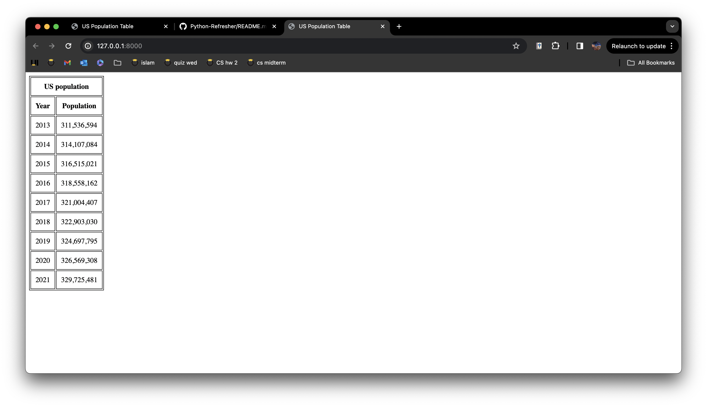

# CS3090-hw2

This repository is for the second homework assingment of CS:3980. The code creates a website that exibits a table of the US population sorted by year which is called from another site. The website layout is shown below.

